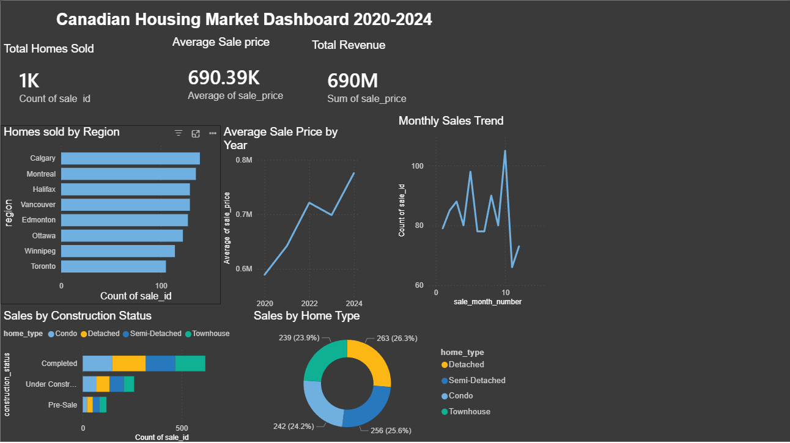

# Canadian Housing Market Dashboard (2020–2024)

A data analytics project built with **SQL (SQLite)** and **Power BI Desktop**, analyzing residential real estate sales trends across 8 major Canadian cities.

---

## Dashboard Preview



---

## Project Overview

This project simulates the kind of reporting and data analysis work done at construction management and real estate software companies. It covers the full data pipeline — from raw data to a polished, interactive business dashboard.

**Key business questions answered:**
- Which Canadian cities have the highest home sales volume?
- How have average sale prices trended from 2020 to 2024?
- What is the breakdown of sales by home type and construction status?
- What are the peak and slow seasons for home sales?
- What are the overall KPI metrics across the entire market?

---

## Tools & Technologies

| Tool | Purpose |
|------|---------|
| SQLite + DB Browser | Database creation and SQL querying |
| SQL | Data analysis and aggregation |
| Power BI Desktop | Interactive dashboard and data visualization |
| CSV | Data storage and import format |

---

## Project Structure

```
canadian-housing-dashboard/
│
├── canadian_housing_data.csv     # Dataset: 1,000 Canadian home sales (2020–2024)
├── housing_queries.sql           # All 7 SQL analysis queries
├── dashboard_screenshot.png      # Final Power BI dashboard screenshot
└── README.md                     # Project documentation
```

---

## Dataset

The dataset contains **1,000 simulated Canadian residential home sales** across 8 major cities from 2020 to 2024.

| Column | Description |
|--------|-------------|
| `sale_id` | Unique identifier for each sale |
| `region` | City (Toronto, Vancouver, Calgary, Ottawa, Edmonton, Montreal, Winnipeg, Halifax) |
| `home_type` | Property type (Detached, Semi-Detached, Townhouse, Condo) |
| `construction_status` | Completed, Under Construction, or Pre-Sale |
| `bedrooms` | Number of bedrooms (1–5) |
| `bathrooms` | Number of bathrooms (1–4) |
| `sqft` | Square footage (500–4,500) |
| `sale_price` | Sale price in CAD (reflects real regional price differences) |
| `sale_date` | Date of sale |
| `sale_year` | Year of sale (2020–2024) |
| `sale_month_name` | Month name |
| `sale_month_number` | Month number (1–12) |

Prices reflect real Canadian market conditions — Vancouver and Toronto are highest, Winnipeg and Halifax are lowest — and include year-over-year appreciation of ~6% to simulate actual market growth.

---

## SQL Queries

All queries are saved in `housing_queries.sql`. Here is a summary:

### Query 1 — Total Homes Sold by Region
Counts the number of sales per city, ordered from highest to lowest.

### Query 2 — Average Sale Price by Region
Calculates average, minimum, and maximum sale prices per city.

### Query 3 — Average Sale Price and Revenue by Year
Tracks total sales volume and average price year over year from 2020 to 2024.

### Query 4 — Sales by Home Type and Construction Status
Breaks down sales count and average price by every combination of home type and construction status.

### Query 5 — KPI Summary Metrics
Single-row query returning all headline KPIs: total homes sold, overall average price, total revenue, average sqft, highest and lowest sale.

### Query 6 — Monthly Sales Seasonality
Identifies which months have the highest and lowest sales activity throughout the year.

### Query 7 — Top 5 Most Expensive Sales
Returns the five highest-value individual transactions in the dataset.

---

## Dashboard Visuals

The Power BI dashboard includes:

- **KPI Cards** — Total Homes Sold (1,000), Average Sale Price ($690K), Total Revenue ($690M)
- **Bar Chart** — Homes Sold by Region
- **Line Chart** — Average Sale Price by Year (2020–2024)
- **Stacked Bar Chart** — Sales by Construction Status, broken down by Home Type
- **Donut Chart** — Sales distribution by Home Type
- **Line Chart** — Monthly Sales Trend (seasonality)

The dashboard is fully interactive — clicking any chart cross-filters all other visuals.

---

## Key Insights

- **Vancouver** has the highest average sale price at ~$1.3M; **Winnipeg** is the most affordable at ~$399K
- Average Canadian home prices grew from **$589K in 2020 to $775K in 2024** (~31% appreciation over 5 years)
- **Detached homes** command the highest prices across all construction statuses
- **October** is the busiest month for sales; **December** is the slowest
- **Completed homes** make up the majority of sales across all property types

---

## How to Run This Project

### SQL (DB Browser for SQLite)
1. Download and install [DB Browser for SQLite](https://sqlitebrowser.org/)
2. Open DB Browser and create a new database
3. Import `canadian_housing_data.csv` as a table named `housing_sales`
4. Open `housing_queries.sql` in the Execute SQL tab and run any query

### Power BI
1. Download and install [Power BI Desktop](https://powerbi.microsoft.com/desktop)
2. Open Power BI and import `canadian_housing_data.csv` via Get Data → Text/CSV
3. Recreate the visuals using the fields described above, or open the `.pbix` file if included

---

## Author

**Abdul Haadee**

